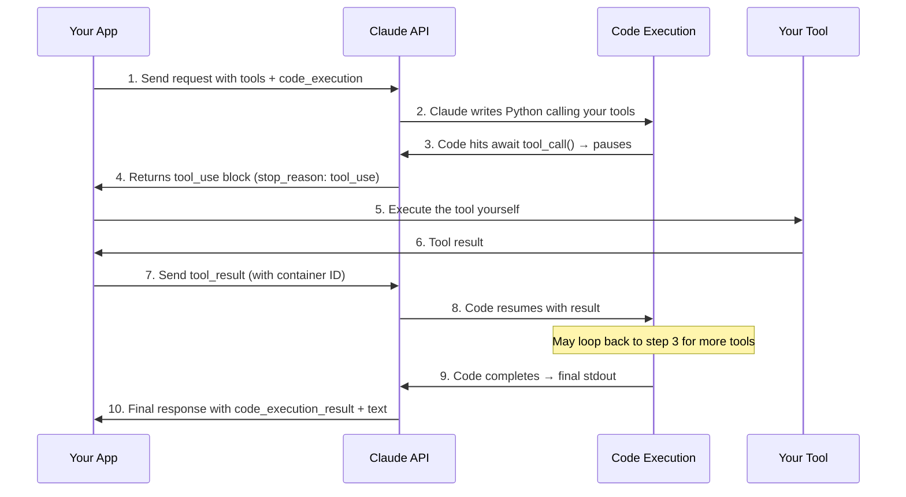

# Programmatic Tool Calling — Claude API

> **Source**: [platform.claude.com/docs/en/agents-and-tools/tool-use/programmatic-tool-calling](https://platform.claude.com/docs/en/agents-and-tools/tool-use/programmatic-tool-calling)

## Overview

Programmatic tool calling lets Claude **write Python code that calls your tools inside a code-execution sandbox**, instead of requiring a separate model round-trip for every tool invocation. This dramatically reduces latency and token consumption for multi-tool workflows.

> [!IMPORTANT]
> Requires the **code execution tool** (`code_execution_20260120`) to be enabled alongside your custom tools.

### Key Benefits

| Benefit | Traditional | Programmatic |
|---|---|---|
| Round-trips for N tools | N model calls | **1** model call |
| Context window usage | All raw results loaded | Only **final summary** loaded |
| Data processing | Model reasons over everything | **Code filters/aggregates** first |
| Token cost (10 tool calls) | ~10× | **~1×** |

---

## Model Compatibility

| Model | Tool Type |
|---|---|
| `claude-opus-4-6` | `code_execution_20260120` |
| `claude-sonnet-4-6` | `code_execution_20260120` |
| `claude-sonnet-4-5-20250929` | `code_execution_20260120` |
| `claude-opus-4-5-20251101` | `code_execution_20260120` |

Available via the **Claude API** and **Microsoft Foundry**.

---

## Core Concepts

### 1. The `allowed_callers` Field

Controls **who** can invoke a tool:

```json
{
  "name": "query_database",
  "description": "Execute a SQL query. Returns rows as JSON objects.",
  "input_schema": { ... },
  "allowed_callers": ["code_execution_20260120"]
}
```

| Value | Meaning |
|---|---|
| `["direct"]` | Only Claude can call it directly (default) |
| `["code_execution_20260120"]` | Only callable from code execution |
| `["direct", "code_execution_20260120"]` | Both (not recommended — pick one) |

> [!TIP]
> Pick **one** caller type per tool for clearer guidance to Claude.

### 2. The `caller` Field in Responses

Every `tool_use` block includes a `caller` field showing how it was invoked:

**Direct invocation:**
```json
{
  "type": "tool_use",
  "id": "toolu_abc123",
  "name": "query_database",
  "input": {"sql": "<sql>"},
  "caller": {"type": "direct"}
}
```

**Programmatic invocation (from code execution):**
```json
{
  "type": "tool_use",
  "id": "toolu_xyz789",
  "name": "query_database",
  "input": {"sql": "<sql>"},
  "caller": {
    "type": "code_execution_20260120",
    "tool_id": "srvtoolu_abc123"
  }
}
```

The `tool_id` references the code execution instance that made the call.

### 3. Container Lifecycle

- **Creation**: New container per session (or reuse an existing one via `container` ID)
- **Expiration**: ~4.5 minutes of inactivity
- **Reuse**: Pass `container` ID in subsequent requests to maintain state
- **Timeout**: Monitor `expires_at` — respond before it expires or Claude sees a `TimeoutError`

---

## How It Works (Step by Step)



### Step 1: Initial Request

```python
response = client.messages.create(
    model="claude-opus-4-6",
    max_tokens=4096,
    messages=[
        {"role": "user", "content": "Identify our top 5 customers by revenue"}
    ],
    tools=[
        {"type": "code_execution_20260120", "name": "code_execution"},
        {
            "name": "query_database",
            "description": "Execute SQL. Returns rows as JSON objects.",
            "input_schema": {
                "type": "object",
                "properties": {
                    "sql": {"type": "string", "description": "SQL query"}
                },
                "required": ["sql"]
            },
            "allowed_callers": ["code_execution_20260120"]
        }
    ]
)
```

### Step 2: API Response — Claude Writes Code + Pauses at Tool Call

```json
{
  "role": "assistant",
  "content": [
    {"type": "text", "text": "I'll query the data and analyze results."},
    {
      "type": "server_tool_use",
      "id": "srvtoolu_abc123",
      "name": "code_execution",
      "input": {
        "code": "results = await query_database('<sql>')\ntop = sorted(results, key=lambda x: x['revenue'], reverse=True)[:5]\nprint(top)"
      }
    },
    {
      "type": "tool_use",
      "id": "toolu_def456",
      "name": "query_database",
      "input": {"sql": "<sql>"},
      "caller": {"type": "code_execution_20260120", "tool_id": "srvtoolu_abc123"}
    }
  ],
  "container": {"id": "container_xyz789", "expires_at": "2025-01-15T14:30:00Z"},
  "stop_reason": "tool_use"
}
```

### Step 3: Provide Tool Result (Reuse Container)

```python
response = client.messages.create(
    model="claude-opus-4-6",
    max_tokens=4096,
    container="container_xyz789",  # Reuse container!
    messages=[
        # Full conversation history ...
        {
            "role": "user",
            "content": [
                {
                    "type": "tool_result",
                    "tool_use_id": "toolu_def456",
                    "content": '[{"customer_id": "C1", "revenue": 45000}, ...]'
                }
            ]
        }
    ],
    tools=[...],  # Same tools
)
```

> [!CAUTION]
> When responding to programmatic tool calls, the user message must contain **only** `tool_result` blocks — no text content allowed.

### Step 4–5: Loop or Complete

Code execution continues. If more tool calls needed → repeat. Once complete:

```json
{
  "content": [
    {
      "type": "code_execution_tool_result",
      "tool_use_id": "srvtoolu_abc123",
      "content": {
        "type": "code_execution_result",
        "stdout": "Top 5 customers by revenue:\n1. C1: $45,000\n...",
        "stderr": "",
        "return_code": 0,
        "content": []
      }
    },
    {"type": "text", "text": "Your top 5 customers generated $167,500 total."}
  ],
  "stop_reason": "end_turn"
}
```

---

## Advanced Patterns

### Batch Processing with Loops

```python
regions = ["West", "East", "Central", "North", "South"]
results = {}
for region in regions:
    data = await query_database(f"<sql for {region}>")
    results[region] = sum(row["revenue"] for row in data)

top_region = max(results.items(), key=lambda x: x[1])
print(f"Top region: {top_region[0]} with ${top_region[1]:,}")
```

**5 regions → 1 model call instead of 5.**

### Early Termination

```python
endpoints = ["us-east", "eu-west", "apac"]
for endpoint in endpoints:
    status = await check_health(endpoint)
    if status == "healthy":
        print(f"Found healthy endpoint: {endpoint}")
        break  # Stop early
```

### Conditional Tool Selection

```python
file_info = await get_file_info(path)
if file_info["size"] < 10000:
    content = await read_full_file(path)
else:
    content = await read_file_summary(path)
print(content)
```

### Data Filtering (Context Window Savings)

```python
logs = await fetch_logs(server_id)
errors = [log for log in logs if "ERROR" in log]
print(f"Found {len(errors)} errors")
for error in errors[-10:]:  # Only return last 10
    print(error)
```

---

## Error Handling

| Error | Cause |
|---|---|
| `invalid_tool_input` | Malformed input to tool |
| `tool_not_allowed` | `allowed_callers` mismatch |
| `missing_beta_header` | Missing required API header |
| `TimeoutError` | Container expired before tool result provided |

### Container Timeout

If your tool takes too long, code execution gets a `TimeoutError`:
```json
{
  "stderr": "TimeoutError: Calling tool ['query_database'] timed out."
}
```

**Prevention:**
- Monitor `expires_at` in responses
- Implement timeouts in your tool execution
- Break long operations into smaller chunks

### Tool Execution Errors

Return errors as tool result content — Claude's code receives and handles them:
```json
{
  "type": "tool_result",
  "tool_use_id": "toolu_abc123",
  "content": "Error: Query timeout - table lock exceeded 30 seconds"
}
```

---

## Constraints & Limitations

| Constraint | Detail |
|---|---|
| **Structured outputs** | `strict: true` not supported with programmatic calling |
| **Tool choice** | Cannot force programmatic calling via `tool_choice` |
| **Parallel tool use** | `disable_parallel_tool_use: true` not supported |
| **MCP tools** | Cannot be called programmatically (yet) |
| **Response format** | Programmatic tool results must be `tool_result` only — no text |
| **Rate limits** | Each programmatic tool call counts as a separate invocation |
| **Security** | Validate external tool results — code injection risk |

---

## Token Efficiency

- Tool results from programmatic calls are **not added** to Claude's context
- Only the **final code output** (stdout) enters the context window
- Intermediate processing (filtering, aggregation) happens in code — **zero model tokens**
- Pricing follows [code execution pricing](https://platform.claude.com/docs/en/agents-and-tools/tool-use/code-execution-tool#usage-and-pricing)

---

## Best Practices

### Tool Design
- **Detailed output descriptions** — document JSON structure, field types
- **Return structured data** — JSON works best for programmatic processing
- **Keep responses concise** — only necessary data

### When to Use Programmatic Calling

✅ **Good use cases:**
- Processing large datasets where you only need aggregates
- Multi-step workflows with 3+ dependent tool calls
- Operations requiring filtering, sorting, transformation
- Tasks where intermediate data shouldn't influence Claude's reasoning
- Parallel operations across many items (e.g., checking 50 endpoints)

❌ **Less ideal:**
- Single tool calls with simple responses
- Tools needing immediate user feedback
- Very fast operations where code execution overhead > benefit

### Performance Optimization
- **Reuse containers** across related requests to maintain state
- **Batch similar operations** in a single code execution

---

## Alternative Implementations

| Approach | Description | Security | Complexity |
|---|---|---|---|
| **Anthropic-managed** | Managed sandbox, optimized for Claude | ✅ Secure | Low |
| **Self-managed sandbox** | Your own sandboxed container | ✅ Secure | High |
| **Client-side direct** | Execute Claude's code locally | ⚠️ Untrusted code risk | Low |
